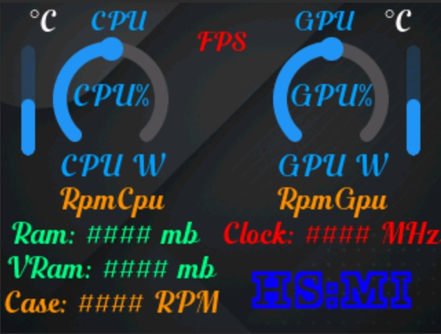
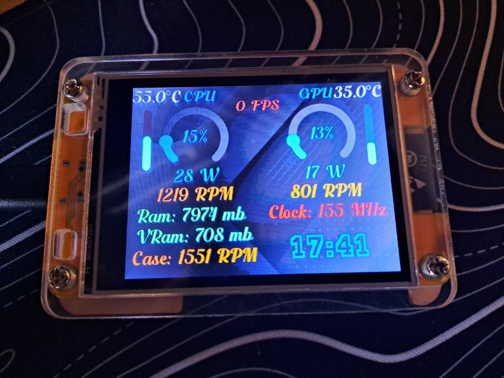

# 🚀 ESP32 Hardware Monitor

<div align="center">
  
  
  
  
</div>

<p align="center">🌐 <b><a href="README.md">English</a> | <a href="README_es.md">Español</a></b></p>

<br>

> **👋 Welcome!** This is my very first major programming project. I built this to learn, solve a personal problem, and hopefully share something cool with the community. Any feedback, suggestions, and pull requests are highly encouraged and appreciated!
<br>

<div align="center">
  
</div>

### 📊 Display Layout Details

The screen interface is structured into **Fixed** and **Modifiable** components to provide a consistent but deeply customizable experience:

- 🟢 **Fixed Components:** Everything from the CPU and GPU Wattage (W) and above is permanently mapped. This includes the CPU & GPU Temperatures, FPS Counter, CPU & GPU Load gauges, and the CPU/GPU Wattage limits. The **Real-Time Clock** at the bottom right is also fixed.
- 🛠️ **Modifiable Slots:** The text display slots located *below* the CPU and GPU Wattage (with the exception of the clock) are fully customizable! You can map these 6 slots to display any LHM hardware sensor data you desire (like RAM, VRAM, Case Fan RPMs, or Network speeds) using the Configurator App.

<br>

<div align="center">
  
</div>

<br>

A highly responsive, standalone ecosystem for monitoring PC hardware vitals directly through an ESP32 TFT screen. Keep track of your system's essential metrics—Temperatures, Wattage, Load, RPMs, and FPS—in real-time without taking up valuable monitor space.

This project seamlessly bridges your PC hardware sensors with your external ESP32 screen using a lightweight, native, background Windows agent and robust Serial-over-USB communication.

---

## ✨ Features

- **Unobtrusive Windows Agent:** A silent, system-tray application that reads real-time metrics natively via the LibreHardwareMonitor API.
- **Dynamic Sensor Mapping:** Includes a built-in GUI Configurator—accessible from the system tray—allowing you to map any hardware sensor (CPU, GPU, RAM, Network, Fans, etc.) to your ESP32 display slots.
- **Deep Hardware Integration:** Analyzes and captures MSR data from CPU temp, package wattage, to DirectX fullscreen framerates using advanced dynamic hooks.
- **Intelligent Auto-Config:** Instantly scans and latches onto the target Arduino COM Port automatically. No manual serial port configuration needed!
- **Sleek Graphics & UI:** A beautiful, responsive TFT interface mapped out via SquareLine Studio, powered by the industry-standard LVGL graphics engine.
- **Silent Automations:** Integrated system tray menus to manipulate data poll rates and seamlessly hook into the Windows Task Scheduler for completely invisible boot automation.

## 🛠️ Prerequisites

Before you begin, ensure you have the following installed and set up:
- **Hardware:** An ESP32 development board with a compatible TFT screen.
  - *Note: This project was developed and specifically tested on the **ESP32-2432S028R** board using the **ILI9341** display driver.*
- **Software Dependencies:**
  - [Arduino IDE](https://www.arduino.cc/en/software) (for compiling/uploading ESP32 code).
  - Python 3.13 or older (if running from source).
  - ESP32 Board Manager installed in Arduino IDE.

## 📂 Installation & Setup

### 1. Hardware Firmware (ESP32)

Due to the varying pinout configurations across different ESP32 development boards, you must compile the firmware directly using the Arduino IDE to ensure compatibility.

1. Download **`ESP32_Firmware.zip`** from the latest **Releases** tab on GitHub and extract it. (Alternatively, you can clone or download this repository's source code).
2. Open the Arduino IDE.
3. Load the `.ino` firmware located in the extracted `ESP32` folder.
4. Select your specific ESP32 board and double-check your pin configurations if necessary.
5. Select your board's COM port.
6. Click **Upload** to compile and flash the firmware.

### 2. Software Setup (Windows)
You can install the application using the user-friendly setup wizard, run it as a portable executable, or build it yourself from the source.

**Option A: Using the Installer (Recommended)**
1. Download `ESP32_Hardware_Monitor_Setup.exe` from the latest **Releases** tab on GitHub (or run it from the `Software\Installer Output` directory).
2. Run the installer to choose your installation location and automatically create desktop shortcuts.
3. Launch the application from your Desktop or Start Menu.
   > **Note:** It will request Administrator privileges once to securely interface with the `PawnIO` kernel proxy driver needed for AMD/Intel thermal mapping.

**Option B: Using the Portable Executable**
1. Download `ESP32 Hardware Monitor.exe` from the latest **Releases** tab on GitHub (or run it from the `Software\ESP32 HWM` directory).
2. Run `ESP32 Hardware Monitor.exe`. 
   > **Note:** It will request Administrator privileges once, similarly to the installer.

**Option C: Building from Source**
1. Clone this repository to your local machine:
   ```bash
   git clone https://github.com/RD-MN/ESP32_HardwareMonitor.git
   ```
2. Run `Software\BuildExec.bat`. This script will seamlessly compile the Python source code (`LHMToSerial.py`) into a standalone `ESP32 Hardware Monitor.exe` using PyInstaller.

## 🚀 Usage

Once the hardware is flashed and the Windows agent is running:
1. Connect your ESP32 to your PC via USB.
2. The Windows application will automatically detect the ESP32 and begin transmitting data.
3. **System Tray Integration:** Look for the ESP32 Hardware Monitor icon in your Windows Taskbar tray (hidden icons).
4. **Right-click the icon** to access key features:
   - **Open ESP32HWM Settings**: Launch the built-in Configurator App to customize your display, easily selecting which hardware sensors appear on your 6 screen slots.
   - Adjust the **Refresh Rates**.
   - Enable/Disable **Run on Startup** for a seamless, invisible boot experience.

## 🤝 Contributing

Contributions, issues, and feature requests are welcome! Since this is my first major project, I'd love any feedback or pull requests to help improve the codebase. 

1. Fork the project
2. Create your feature branch (`git checkout -b feature/AmazingFeature`)
3. Commit your changes (`git commit -m 'Add some AmazingFeature'`)
4. Push to the branch (`git push origin feature/AmazingFeature`)
5. Open a Pull Request

## ⚠️ Disclaimer

This is a personal hobby project and some of the development was assisted by **Antigravity AI**. While extensive effort has been made to ensure stability, there is always the possibility of bugs, unhandled errors, or edge cases. Please use it at your own discretion. Feel free to open an issue if you encounter any strange behavior!

## Licenses

This project is licensed under the [MIT License](LICENSE).

### Third-Party Licenses

- [LibreHardwareMonitor](https://github.com/LibreHardwareMonitor/LibreHardwareMonitor) - [Mozilla Public License 2.0 (MPL-2.0)](https://github.com/LibreHardwareMonitor/LibreHardwareMonitor/blob/master/LICENSE)
- [LVGL](https://lvgl.io/) - [MIT License](https://github.com/lvgl/lvgl/blob/master/LICENCE.txt)
- [Arduino Core Packages](https://www.arduino.cc/) - [LGPL](https://www.gnu.org/licenses/lgpl-2.1.html)
